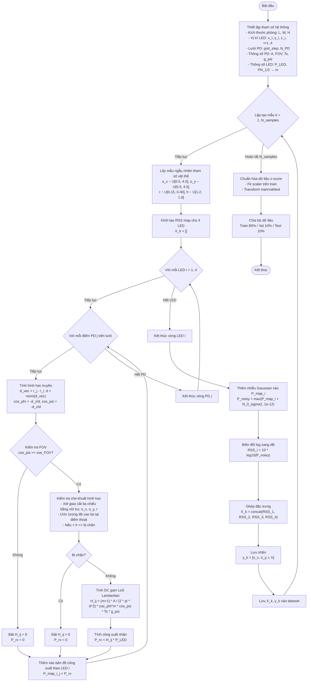

```mermaid
flowchart TD
    A(["Bắt đầu"]) --> B["Thiết lập tham số hệ thống<br/>- Kích thước phòng: L, W, H<br/>- Vị trí LED: x_i, y_i, z_i, i=1..4<br/>- Lưới PD: grid_step, N_PD<br/>- Thông số PD: A, FOV, Ts, g_psi<br/>- Thông số LED: P_LED, Phi_1/2 → m"]
    
    B --> C{"Lặp tạo mẫu k = 1..N_samples"}
    
    C -->|Tiếp tục| D["Lấy mẫu ngẫu nhiên tham số vật thể<br/>o_x ~ U[0.5, 4.5], o_y ~ U[0.5, 4.5]<br/>r ~ U[0.15, 0.40], h ~ U[1.2, 1.9]"]
    
    D --> E["Khởi tạo RSS map cho 4 LED<br/>X_k = []"]
    
    E --> F{"Với mỗi LED i = 1..4"}
    
    F -->|Tiếp tục| G{"Với mỗi điểm PD j trên lưới"}
    
    G -->|Tiếp tục| H["Tính hình học truyền<br/>d_vec = r_j - l_i, d = norm(d_vec)<br/>cos_phi = -d_z/d, cos_psi = -d_z/d"]
    
    H --> I{"Kiểm tra FOV<br/>cos_psi >= cos_FOV?"}
    
    I -- Không --> J["Đặt H_ij = 0<br/>P_rx = 0"]
    J --> N
    
    I -- Có --> K["Kiểm tra che khuất hình học<br/>- Xét giao cắt tia chiếu bằng với trụ: o_x, o_y, r<br/>- Ước lượng độ cao tia tại điểm thoát<br/>- Nếu < h => bị chặn"]
    
    K --> L{"Bị chặn?"}
    
    L -- Có --> M["Đặt H_ij = 0<br/>P_rx = 0"]
    M --> N
    
    L -- Không --> O["Tính DC gain LoS Lambertian<br/>H_ij = (m+1) * A / (2 * pi * d^2) * cos_phi^m * cos_psi * Ts * g_psi"]
    
    O --> P["Tính công suất nhận<br/>P_rx = H_ij * P_LED"]
    
    P --> N["Thêm vào bản đồ công suất theo LED i<br/>P_map_i_j = P_rx"]
    
    N --> G
    
    G -->|Hết PD| Q["Kết thúc vòng PD j"]
    Q --> F
    
    F -->|Hết LED| R["Kết thúc vòng LED i"]
    
    R --> S["Thêm nhiễu Gaussian vào P_map_i<br/>P_noisy = max(P_map_i + N_0_sigma2, 1e-12)"]
    
    S --> T["Biến đổi log sang dB<br/>RSS_i = 10 * log10(P_noisy)"]
    
    T --> U["Ghép đặc trưng<br/>X_k = concat(RSS_1, RSS_2, RSS_3, RSS_4)"]
    
    U --> V["Lưu nhãn<br/>y_k = [o_x, o_y, r, h]"]
    
    V --> W["Lưu X_k, y_k vào dataset"]
    
    W --> C
    
    C -->|Hoàn tất N_samples| X["Chuẩn hóa dữ liệu z-score<br/>- Fit scaler trên train<br/>- Transform train/val/test"]
    
    X --> Y["Chia bộ dữ liệu<br/>Train 80% / Val 10% / Test 10%"]
    
    Y --> Z(["Kết thúc"])
```